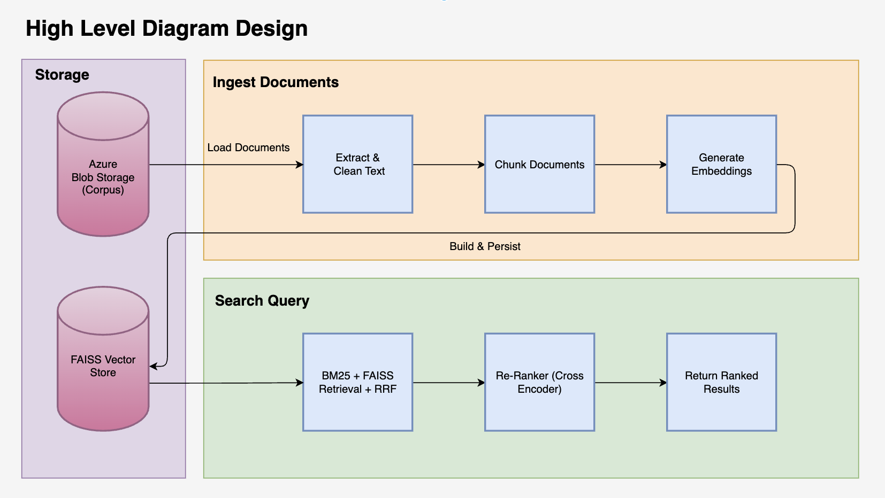
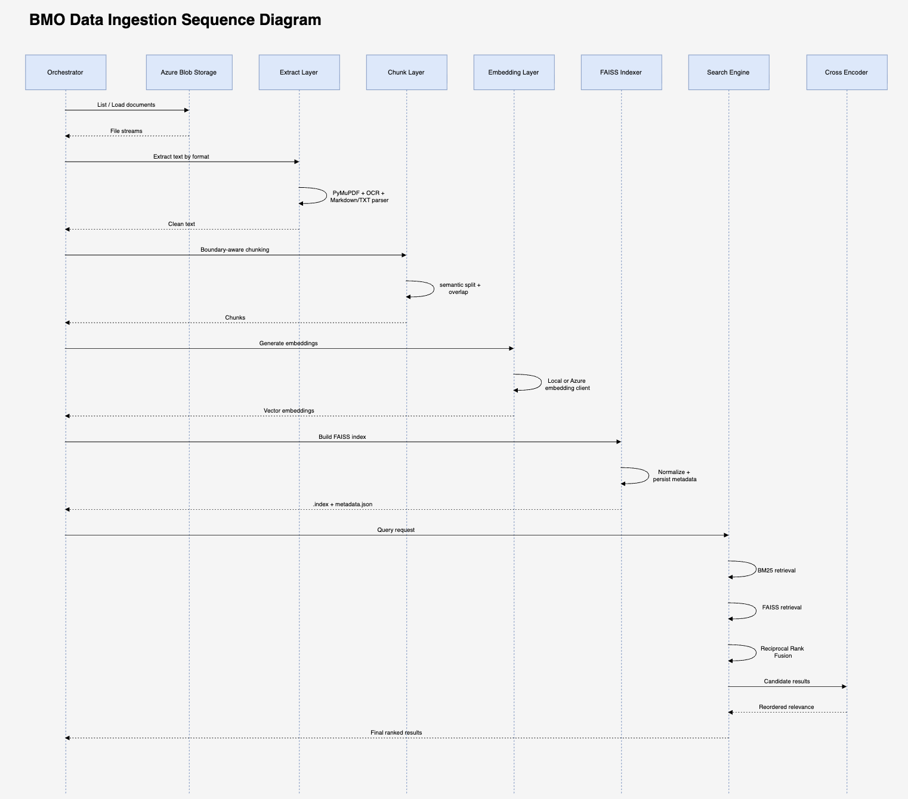

# RAG Pipeline

A **Retrieval-Augmented Generation (RAG)** ingestion and search system with a local FAISS-based retrieval backend. It extracts text from PDFs (digital + scanned), Markdown, and plain-text documents stored in Azure Blob Storage, chunks them intelligently, generates vector embeddings via Azure OpenAI or local sentence-transformers, indexes them in a FAISS vector store, and serves keyword, vector, and hybrid retrieval with cross-encoder semantic re-ranking.

---

## Architecture


### Sequence Diagram


### Component Overview

| File | Responsibility |
|------|---------------|
| `src/extract.py` | Downloads blobs, extracts text from PDF/MD/TXT; falls back to local Tesseract OCR for scanned PDFs |
| `src/chunk.py` | Splits text with LangChain's `RecursiveCharacterTextSplitter` using heading/paragraph/sentence-aware separators and configurable overlap |
| `src/embed.py` | Batched embedding calls to Azure OpenAI (`EmbeddingClient`) or local sentence-transformers (`LocalEmbeddingClient`) |
| `src/index.py` | Builds, saves, loads, and queries a local FAISS `IndexFlatIP` vector index with a JSON metadata sidecar |
| `src/ingest.py` | End-to-end CLI orchestrator: Extract → Chunk → Embed → Index (FAISS) |
| `src/search.py` | Local keyword (BM25), vector (FAISS cosine), and hybrid (BM25 + FAISS via RRF + cross-encoder re-ranking) search |
| `config.py` | Loads all configuration from environment variables / `.env` file via python-dotenv |
| `notebooks/pipeline_demo.ipynb` | End-to-end interactive walkthrough: runs Extract → Chunk → Embed → Index → Search in sequence, inspects intermediate outputs at each stage, and exercises keyword, vector, and hybrid queries against the local FAISS index |

---

## Quick Start

### Prerequisites

- Python 3.10+
- **Azure Blob Storage** – document store (required for ingestion)
- **Azure OpenAI** `text-embedding-ada-002` deployment *(local sentence-transformers used by default)*
- **Tesseract OCR** installed locally *(for scanned PDFs)*

### Installation

```bash
https://github.com/GhazalHashemi97/BMO-Interview.git
cd BMO-Interview
python -m venv .venv && source .venv/bin/activate   # Windows: .venv\Scripts\activate
pip install -r requirements.txt
```

### Configuration

Configuration is loaded by `config.py` from environment variables or a `.env` file in the project root.

```bash
# Copy and fill in your credentials
cp config.template.json config.local.json   # reference only
```

### Run the Ingestion Pipeline

```bash
# List all available arguments and their descriptions
python src/ingest.py --help

# Full example — local sentence-transformers, custom index paths, OCR, and verbose output
python src/ingest.py \
    --connection-string "CONN_STR" \
    --container "bmo-data-test" \
    --index-path "pipeline_demo_faiss.index" \
    --metadata-path "pipeline_demo_faiss_metadata.json" \
    --chunk-size 1200 \
    --overlap 100 \
    --min-chunk-size 200 \
    --tesseract-lang "eng" \
    --ocr-threshold 100 \
    --retry-delay 1.0 \
    --embedder local \
    --local-model "all-MiniLM-L6-v2" \
    --recreate \
    --verbose
```

The pipeline always writes a FAISS `.index` file and a JSON metadata sidecar that can be reloaded later without re-ingesting.

### Run the Notebook

```bash
jupyter notebook notebooks/pipeline_demo.ipynb
```

The notebook is self-contained and configures itself via `config.py`. Set `USE_LOCAL_EMBEDDINGS=True` in `.env` (or the default) to run without Azure OpenAI credentials.

| Section | What it demonstrates |
|---------|----------------------|
| **0 – Setup** | Imports and loads configuration from `config.py` |
| **1 – Extract** | Pulls documents from Azure Blob Storage and inspects extracted text |
| **2 – Chunk** | Splits documents into overlapping chunks with `TextChunker` |
| **3 – Embed** | Generates vector embeddings (local or Azure OpenAI) |
| **4 – Index** | Builds and persists a FAISS index; reloads it from disk |
| **5 – Search** | Runs keyword, vector, and hybrid queries with `LocalSearchEngine` |

---

## Design Decisions

### 1. Extract

The extraction layer is designed for mixed enterprise document formats and variable PDF quality. It pulls blobs from Azure Storage and applies format-aware parsing:

1. PDF text extraction with PyMuPDF for digital PDFs.
2. OCR fallback with local Tesseract for scanned/image PDFs.
3. Direct parsing for Markdown and plain-text files.

This design prioritizes robustness over strict speed so ingestion can proceed even when some files are noisy, scanned, or partially machine-readable.

### 2. Chunk

Chunking is boundary-aware instead of fixed-size splitting. The splitter attempts semantic boundaries first (headings, paragraphs, line breaks, sentence punctuation) and only hard-cuts as a last resort.

Defaults are tuned for retrieval quality:

1. Chunk size: 1200 characters.
2. Overlap: 200 characters.
3. Small-fragment merge: tiny trailing chunks are merged into previous chunks.

This improves context continuity and reduces retrieval of short, low-information fragments.

### 3. Embed

Embedding is abstracted behind a common client interface so the pipeline can run in two modes:

1. Local sentence-transformers for offline and low-cost development.
2. Azure OpenAI embeddings for production-style cloud integration.

The implementation batches requests for throughput and keeps metadata aligned with each vector to simplify downstream indexing and debugging.


### 4. Index

The indexing layer uses FAISS `IndexFlatIP` with L2-normalized vectors so inner product behaves as cosine similarity. The pipeline always writes a FAISS `.index` file and a JSON metadata sidecar that can be reloaded later without re-ingesting.

### 5. Ingest Orchestration

Ingestion is implemented as a single orchestrated flow in the CLI:

1. Extract documents.
2. Chunk text.
3. Generate embeddings.
4. Build and persist index artifacts.

This step is intentionally explicit and reproducible, making it easy to rerun with different parameters (chunk size, overlap, embedder choice, prefix filters).


### 6. Search

Search combines lexical and semantic retrieval in a staged strategy:

1. BM25 keyword scoring for exact term matching.
2. FAISS vector scoring for semantic similarity.
3. Reciprocal Rank Fusion (RRF) to merge both signals.
4. Cross-encoder reranking for final relevance ordering.

The goal is balanced recall and precision across both exact technical queries and paraphrased natural-language questions.


---

# Assumptions

1. Documents in Blob Storage are organised under prefix folders (e.g. `/manuals/`, `/troubleshooting/`, `/policies/`).
2. The pipeline assumes documents are consistently organized under meaningful top-level folders.
The folder prefix is treated as document **category** metadata.
3. When using Azure OpenAI embeddings, the `text-embedding-ada-002` (1536-dim) deployment is used. Switching to another model only requires changing `OPENAI_DEPLOYMENT`; the FAISS index dimension adapts automatically.
4. Blob Storage connection string or SAS token is used for document access.
5. Tesseract OCR is used as the open-source OCR tool; the pipeline falls back to direct PyMuPDF text extraction for digital PDFs.

---

### PDF Type Assumption

The current extraction flow assumes that each PDF is either:

- fully digital (machine-readable text), or  
- fully scanned (image-based OCR required)

Mixed PDFs containing both digital and scanned pages are not explicitly handled at page level.

---

### Local Execution Assumption

- Since managed cloud search services were not available during implementation, local FAISS indexing and local embedding models were used as the baseline solution. The architecture remains extensible and can be adapted in the future to use Azure AI Search or Azure OpenAI Service embedding models if cloud services become available.

- The current pipeline performs full document ingestion and indexing, but it does not support incremental updates, partial re-indexing, or automatic synchronization when source documents change.

---
# Known Limitations and Recommended Improvements

 | # | Limitation Area | Current Issue | Recommended Improvement | Trade-offs / Notes |
|---|----------------|---------------|------------------------|------------------|
| 1 | Non-Text Content (Tables, Images, Structured Layouts) | PDF tables flattened;<br>chunking may split tables → loss of headers/row relationships | **Option A:** Store full table in one chunk<br>**Option B:** Table-aware chunking with repeated headers<br>**Option C:** Extract tables into structured storage (PostgreSQL, Azure SQL, MongoDB) with retrieval layer | Option A: may exceed embedding/LLM token limits<br>Option B: preserves semantics, fits token limits<br>Option C: best for enterprise-scale structured documents |
| 2 | Mixed PDF OCR Handling (Scanned + Digital Pages) | OCR applied based on document-level threshold; may skip scanned pages if digital text exceeds threshold | Page-level OCR detection: extract text per page, detect pages with images <br> Use Azure AI Document Intelligence (Read/Layout models)| Reduces silent data loss; ensures all pages processed <br> ADI provide Layout-aware extraction, table detection, key-value extraction, mixed-page handling, handwriting support |
| 3 | OCR Accuracy | Tesseract OCR struggles with low-quality scans, unusual fonts, rotated pages, tables, forms, complex layouts | Use more accurate OCR engines: Azure AI Document Intelligence, Google Cloud Vision, Amazon Textract | N/A |
| 4 | Images Without OCR Text | Images without text (charts, diagrams, photos) ignored → context loss | Use vision model to generate semantic descriptions and embed with surrounding text<br>  Multimodal retrieval: store vector representations of image descriptions, original image path in metadata, combine vector + metadata + document store  | Improves retrieval for image-related queries <br> Enhances search quality for multi modal content |
| 5 | Full Reprocessing on Every Ingest Run | Every run re-extracts all documents, re-generates embeddings, rebuilds FAISS index → unnecessary compute, slower ingestion, repeated embedding API usage | Introduce change-tracking: track last modified timestamp, file hash, or Blob ETag; process only new/modified documents; incrementally update index | Improves performance, reduces cost, scales efficiently |
| 6 | Local Embedding Model Trade-Off | `all-MiniLM-L6-v2` is lightweight but may underperform for complex enterprise content | Use stronger embedding models: OpenAI `text-embedding-3-small` or `text-embedding-3-large` | Higher retrieval quality; may require more compute |
| 7 | Local FAISS Trade-Off | Works locally but lacks production features: native metadata filtering, managed scaling, semantic ranking, hybrid retrieval | Use Azure AI Search for managed hybrid retrieval with BM25 keyword search, vector search, semantic ranking, and metadata filtering | Provides production-grade features and scalability |
| 8 | Text Splitting Accuracy | Character/text splitters often break sentences or ideas, leading to fragmented context|Use semantic chunking to split based on meaning, paragraphs, or sentence boundaries|Slightly higher computation and preprocessing time

### Planned Future Enhancements

- Metadata-aware chunk filtering  
- Incremental indexing  
- Multimodal retrieval  

## Project Structure

```
rag-data-ingestion-pipeline/
├── src/
│   ├── extract.py       # Blob download + text extraction (PDF/MD/TXT + OCR)
│   ├── chunk.py         # Boundary-aware recursive text splitting
│   ├── embed.py         # Azure OpenAI / local sentence-transformers embeddings
│   ├── index.py         # Local FAISS index: build, save, load, search
│   ├── ingest.py        # CLI pipeline orchestrator (Extract → Chunk → Embed → Index)
│   └── search.py        # Keyword (BM25) / vector / hybrid search + cross-encoder re-ranking
├── notebooks/
│   └── pipeline_demo.ipynb
├── docs/
│   └── README.md        # ← you are here
├── config.py            # Configuration loader (python-dotenv)
├── requirements.txt
└── .gitignore
```
